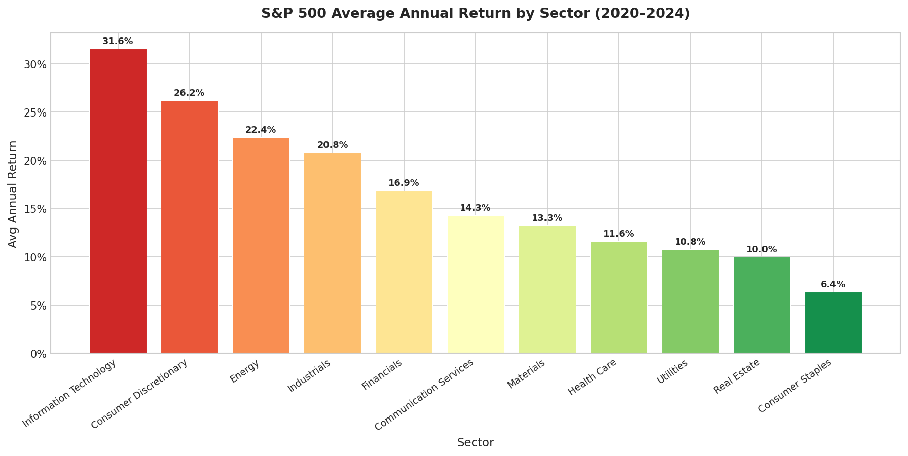
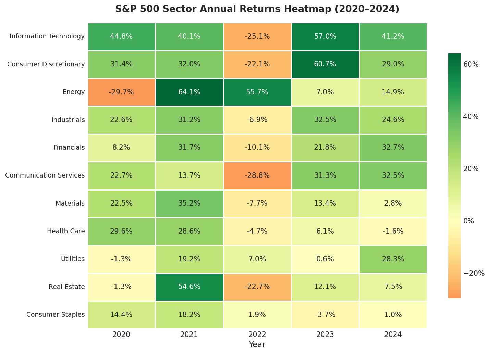
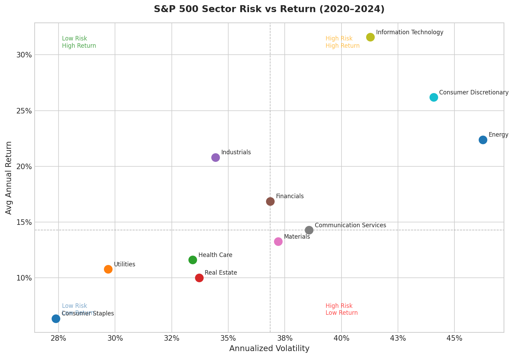
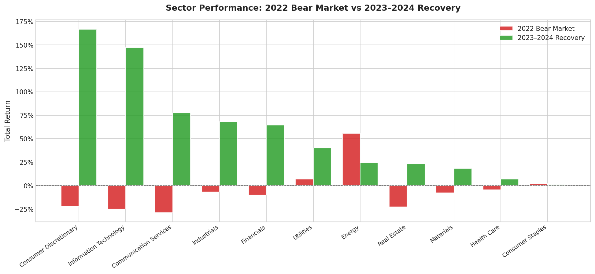

# S&P 500 Sector Performance Analysis (2020–2024)

An end-to-end data analytics project analyzing S&P 500 sector performance across five years of market cycles — including the COVID recovery, 2021 bull run, 2022 bear market, and 2023–2024 recovery.

Built with Python, SQL (SQLite), and Matplotlib/Seaborn.

---

## Key Findings

- **Information Technology** averaged **31.6% annual return** over the period — the highest of any sector, but also among the most volatile (41% annualized volatility)
- **Consumer Staples** was the lowest-risk sector (28% annualized volatility) but delivered only **6.4% avg annual return** — the classic defensive trade-off
- **Energy** was the only sector with a **positive return in the 2022 bear market (+55.7%)**, driven by the oil price shock following Russia's invasion of Ukraine — but significantly underperformed during the 2023–2024 recovery
- **Every sector posted negative average daily returns** during the Fed's mid-rate-hiking window (funds rate 1–4%), confirming that the transition period of tightening — not the peak — was most damaging to equities
- **Consumer Discretionary and IT** suffered the sharpest bear market drawdowns (-22% and -25%) but recovered the strongest in 2023–2024 (+167% and +147%)

---

## Charts

### Average Annual Return by Sector


### Annual Returns Heatmap (2020–2024)


### Risk vs Return


### Bear Market vs Recovery


---

## Project Structure

```
finance-sector-analysis/
├── data/
│   ├── raw/                        # Output of fetch_data.py
│   └── cleaned/                    # Output of clean_data.py
├── scripts/
│   ├── fetch_data.py               # Pull S&P 500 tickers, prices, macro data
│   ├── clean_data.py               # Clean, normalize, interpolate
│   ├── load_to_db.py               # Load into SQLite with indexes
│   ├── analyze.py                  # Run SQL queries, export CSVs
│   └── visualize.py                # Generate charts
├── sql/
│   ├── sector_annual_returns.sql   # Annual return per sector per year
│   ├── sector_volatility.sql       # Volatility + Sharpe-like ratio
│   ├── bear_vs_recovery.sql        # 2022 bear vs 2023-2024 recovery
│   ├── top_bottom_stocks_per_sector.sql  # Top/bottom 3 stocks per sector
│   └── macro_correlation.sql       # Returns by interest rate regime
├── outputs/
│   ├── charts/                     # PNG charts
│   └── tables/                     # CSV query results
├── finance.db                      # SQLite database
└── README.md
```

---

## Data Sources

| Data | Source | Method |
|---|---|---|
| S&P 500 tickers + sectors | Wikipedia | `pandas.read_html` |
| Daily adjusted close prices | Yahoo Finance | `yfinance` |
| Federal Funds Rate | FRED (St. Louis Fed) | CSV download |
| CPI (inflation) | FRED (St. Louis Fed) | CSV download |

All data is free and publicly available. Re-running `fetch_data.py` pulls fresh data.

---

## Methodology

**Returns** are calculated as price return only (no dividends) using adjusted closing prices. Annual return for a sector = average of individual ticker returns within that sector for the calendar year.

**Volatility** is annualized standard deviation of daily returns: `daily_stddev × √252`. SQLite has no native `STDDEV()` function, so it is computed manually using the identity `SQRT(AVG(x²) - AVG(x)²)`.

**Sharpe-like ratio** is `avg_daily_return / daily_stddev` — a simplified risk-adjusted return measure. No risk-free rate is subtracted.

**Macro regime analysis** buckets the Federal Funds Rate into three regimes: low (<1%), mid (1–4%), and high (≥4%), then compares average sector daily returns within each regime.

**Bear/recovery windows:**
- Bear market: January–December 2022 (S&P 500 fell ~19%)
- Recovery: January 2023–December 2024

---

## How to Run

### 1. Clone the repo and install dependencies

```bash
git clone https://github.com/aidanraync/finance-sector-analysis.git
cd finance-sector-analysis
pip install yfinance pandas requests lxml matplotlib seaborn
```

### 2. Run the pipeline in order

```bash
python scripts/fetch_data.py      # ~3-5 min (downloads ~500 tickers)
python scripts/clean_data.py
python scripts/load_to_db.py
python scripts/analyze.py
python scripts/visualize.py
```

Outputs will appear in `outputs/tables/` (CSV) and `outputs/charts/` (PNG).

---

## SQL Highlights

The `sql/` directory contains five standalone queries designed to be readable on their own. Notable techniques used:

- **CTEs** for multi-step return calculations without nested subquery spaghetti
- **Window functions** (`ROW_NUMBER() OVER PARTITION BY`) for ranking stocks within sectors
- **Manual STDDEV** implementation for SQLite compatibility
- **CASE-based period splitting** to compare bear vs recovery in a single query
- **Date-keyed table joins** between price and macro data

---

## Related Projects

- [Dothan Cardiac Arrest GIS Mapping](https://github.com/YOUR_USERNAME/dothan-cardiac-gis) — spatial analysis of cardiac arrest response times using Python and GIS tools
